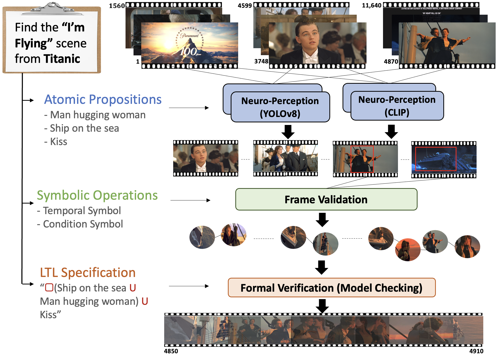

<div align="center">

# Neuro Symbolic Video Search with Temporal Logic (NSVS-TL)

[](https://arxiv.org/abs/2403.11021) [](https://arxiv.org/abs/2403.11021) [](https://utaustin-swarmlab.github.io/nsvs-project-page.github.io/) [](https://github.com/UTAustin-SwarmLab/Neuro-Symbolic-Video-Search-Temporal-Logic) [](https://github.com/UTAustin-SwarmLab/Temporal-Logic-Video-Dataset)
</div>


## Table of Contents

- [Neuro Symbolic Video Search with Temporal Logic (NSVS-TL)](#neuro-symbolic-video-search-with-temporal-logic-nsvs-tl)
  - [Table of Contents](#table-of-contents)
  - [TL;DR](#tldr)
  - [Abstract](#abstract)
    - [System Overview](#system-overview)
  - [Installation Guide](#installation-guide)
  - [System Setup and Execution Guide](#system-setup-and-execution-guide)
  - [Running the System](#running-the-system)
  - [FAQ](#faq)
  - [Connect with Me](#connect-with-me)
  - [Citation](#citation)

## TL;DR

This paper introduces a neuro-symbolic video search framework that marries the capabilities of neural networks for frame-by-frame perception with the structured reasoning of temporal logic. This hybrid approach allows for advanced querying of massive video datasets, such as those from YouTube, autonomous vehicles, and security systems. By separating the tasks of perception and temporal reasoning, our method overcomes the limitations of current video-language models in accurately localizing specific scenes within lengthy videos. This innovation not only enhances the precision of video searches but also facilitates the handling of complex queries that require understanding the temporal relationships between events in video content.

## Abstract

<details>
<summary>Click to expand</summary>
The unprecedented surge in video data production in recent years necessitates efficient tools to extract meaningful frames from videos for downstream tasks. Long-term temporal reasoning is a key desideratum for frame retrieval systems. While state-of-the-art foundation models, like VideoLLaMA and ViCLIP, are proficient in short-term semantic understanding, they surprisingly fail at long-term reasoning across frames. A key reason for this failure is that they intertwine per-frame perception and temporal reasoning into a single deep network. Hence, decoupling but co-designing the semantic understanding and temporal reasoning is essential for efficient scene identification. We propose a system that leverages vision-language models for semantic understanding of individual frames but effectively reasons about the long-term evolution of events using state machines and temporal logic (TL) formulae that inherently capture memory. Our TL-based reasoning improves the F1 score of complex event identification by $9-15$\% compared to benchmarks that use GPT-4 for reasoning on state-of-the-art self-driving datasets such as Waymo and NuScenes.
</details>

### System Overview

<div align="center">
  <a href="https://github.com/UTAustin-SwarmLab/temporal-logic-video-dataset">
    
  </a>
</div>

The input query --- "Find the I'm Flying scene from Titanic" --- is first decomposed into semantically meaningful atomic propositions such as ``man hugging woman``, ``ship on the sea``, and ``kiss`` from a high-level user query. SOTA vision and vision-language models are then employed to annotate the existence of these atomic propositions in each video frame. Subsequently, we construct a probabilistic automaton that models the video's temporal evolution based on the list of per-frame atomic propositions detected in the video. Finally, we evaluate when and where this automaton satisfies the user's query. We do this by expressing it in a formal specification language that incorporates temporal logic. The TL equivalent of the above query is ALWAYS ($\Box$) ``man hugging woman`` UNTIL ($\mathsf{U}$) ``ship on the sea`` UNTIL ($\mathsf{U}$) ``kiss``. Formal verification techniques are utilized on the automaton to retrieve scenes that satisfy the TL specification.

## Installation Guide

**Prerequisites**  
No need to worry about the prerequisites below if you are using a UT Swarm Lab cluster.

- CUDA Driver: Version 11.8.0 or higher
- Docker: Nvidia Driver
**Development Environment Setup**

1. Clone this repository.
2. Navigate to the makefile and modify the user input section.
    - For example: `CODE_PATH := /home/repos/Neuro-Symbolic-Video-Search-Temporal-Logic/`
3. Execute `make pull_docker_image`
4. Execute `make build_docker_image`
5. Execute `make run_docker_container_gpu`
    - Note: If you are a developer: `make run_dev_docker_container_gpu`
6. Execute `make exec_docker_container`
7. Inside the container, navigate to `/opt/Neuro-Symbolic-Video-Search-Temporal-Logic`
8. Inside the container, execute `bash install.sh`
    - Note: If you are a developer: `bash install.sh dev`

**Development Inside the Container**
Enjoy your development environment inside the container!

Please avoid stopping and removing the container, as you will need to reinstall the dependencies. If the container is stopped or removed, repeat steps 5 to 8.

## System Setup and Execution Guide

**Note that we've opted out the system run with the TLV dataset in the current version. If you're interested in running the code with TLV dataset, please use `v1.0.0` version. All versions after `v1.0.0` only supports for the real video.** 

## Running the System

Run NSVS-TL with single object detector, YOLO.
```python
from ns_vfs import run_nsvs_yolo
from cvias.image.detection.object.yolo import Yolo

model_list = Yolo.available_models()

run_nsvs_yolo(
   video_path="video_path",
   desired_fps="fps", # optional: desired_interval_in_sec="You can get the frame by sec", 
   proposition_set=["prop1", "prop2"], # e.g.["car", "truck"],
   ltl_formula='"prop1" U "prop2"' # e.g.'"car" U "truck"'
   yolo_model_name="model from model_list" # e.g. "YOLOv8x",
   output_path="output dir",
   threshold_satisfaction_probability=0.80,
    )
```


## FAQ
Q: We are receiving a smaller number of frames. For instance, we need frame 81 to be included in the frames of interest, but nsvs-tl results in [...,21].

A: This issue involves video processing. You are looking at frames 0 to 81. However, the last frame index is 21 if you didn’t change the video processor's parameters. Make sure to use correct parameters for `desired_fps` or `desired_interval_in_sec`.


## Connect with Me

<p align="center">
  <em>Feel free to connect with me through these professional channels:</em>
<p align="center">
  <a href="https://www.linkedin.com/in/mchoi07/" target="_blank"></a>
  <a href="mailto:minkyu.choi@utexas.edu"></a>
  <a href="https://scholar.google.com/citations?user=ai4daB8AAAAJ&hl" target="_blank"></a>
  <a href="https://minkyuchoi-07.github.io" target="_blank"></a>
  <a href="https://x.com/MinkyuChoi7" target="_blank"></a>
</p>

## Citation

If you find this repo useful, please cite our paper:

```bibtex
@inproceedings{Choi_2024_ECCV,
  author={Choi, Minkyu and Goel, Harsh and Omama, Mohammad and Yang, Yunhao and Shah, Sahil and Chinchali, Sandeep},
  title={Towards Neuro-Symbolic Video Understanding},
  booktitle={Proceedings of the European Conference on Computer Vision (ECCV)},
  month={September},
  year={2024}
}
```
