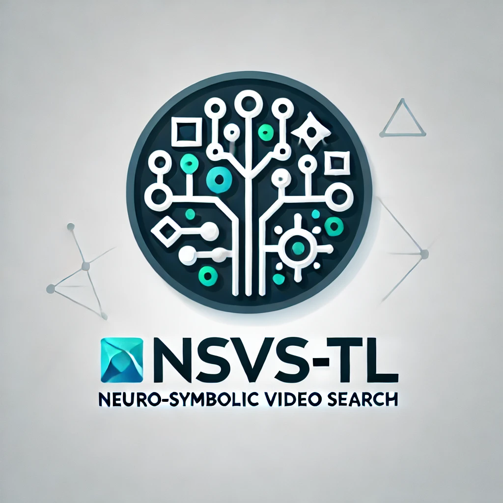

# Neuro Symbolic Video Search with Temporal Logic (NSVS-TL)

[![Contributors][contributors-shield]][contributors-url] [![Forks][forks-shield]][forks-url] [![Stargazers][stars-shield]][stars-url] [![MIT License][license-shield]][license-url]

## Overview
<!-- PROJECT LOGO -->
<br />
<div align="center">
  <a href="https://github.com/UTAustin-SwarmLab/Neuro-Symbolic-Video-Search-Temploral-Logic">
    
  </a>

  <h3 align="center">Neuro Symbolic Video Search with Temporal Logic</h3>

  <p align="center">
    Unleashing Video Intelligence: Where Vision Meets Logic
    <br />
    <a href="https://arxiv.org/abs/2403.11021"><strong>» Read Paper »</strong></a>
    <br />
    <br />
    <a href="https://utaustin-swarmlab.github.io/nsvs-project-page.github.io/">NSVS-TL Project Webpage</a>
    ·
    <a href="https://github.com/UTAustin-SwarmLab/Neuro-Symbolic-Video-Search-Temploral-Logic">TLV Dataset</a>
  </p>
</div>

## Table of Contents

- [TL;DR](#TL;DR)
- [Abstract](#abstract)
- [Installation Guide](#installation-guide)

## TL;DR

This paper introduces a neuro-symbolic video search framework that marries the capabilities of neural networks for frame-by-frame perception with the structured reasoning of temporal logic. This hybrid approach allows for advanced querying of massive video datasets, such as those from YouTube, autonomous vehicles, and security systems. By separating the tasks of perception and temporal reasoning, our method overcomes the limitations of current video-language models in accurately localizing specific scenes within lengthy videos. This innovation not only enhances the precision of video searches but also facilitates the handling of complex queries that require understanding the temporal relationships between events in video content.

## Abstract

<details>
<summary>Click to expand</summary>
The unprecedented surge in video data production in recent years necessitates efficient tools to extract meaningful frames from videos for downstream tasks. Long-term temporal reasoning is a key desideratum for frame retrieval systems. While state-of-the-art foundation models, like VideoLLaMA and ViCLIP, are proficient in short-term semantic understanding, they surprisingly fail at long-term reasoning across frames. A key reason for this failure is that they intertwine per-frame perception and temporal reasoning into a single deep network. Hence, decoupling but co-designing the semantic understanding and temporal reasoning is essential for efficient scene identification. We propose a system that leverages vision-language models for semantic understanding of individual frames but effectively reasons about the long-term evolution of events using state machines and temporal logic (TL) formulae that inherently capture memory. Our TL-based reasoning improves the F1 score of complex event identification by $9-15$\% compared to benchmarks that use GPT-4 for reasoning on state-of-the-art self-driving datasets such as Waymo and NuScenes.
</details>

### System Overview
<div align="center">
  <a href="https://github.com/UTAustin-SwarmLab/temporal-logic-video-dataset">
    
  </a>
</div>
The input query --- "Find the `I'm Flying scene from Titanic" --- is first decomposed into semantically meaningful atomic propositions such as ``man hugging woman``, ``ship on the sea``, and ``kiss`` from a high-level user query. SOTA vision and vision-language models are then employed to annotate the existence of these atomic propositions in each video frame. Subsequently, we construct a probabilistic automaton that models the video's temporal evolution based on the list of per-frame atomic propositions detected in the video. Finally, we evaluate when and where this automaton satisfies the user's query. We do this by expressing it in a formal specification language that incorporates temporal logic. The TL equivalent of the above query is ALWAYS ($\Box$) ``man hugging woman`` UNTIL ($\mathsf{U}$) ``ship on the sea`` UNTIL ($\mathsf{U}$) ``kiss``. Formal verification techniques are utilized on the automaton to retrieve scenes that satisfy the TL specification.

## Installation Guide

**Prerequisites**  
No need to worry about the prerequisites below if you are using a UT Swarm Lab cluster.

- CUDA Driver: Version 11.8.0 or higher
- Docker: Nvidia Driver
**Development Environment Setup**

1. Clone this repository.
2. Navigate to the makefile and modify the user input section.
    - For example: `CODE_PATH := /home/repos/Neuro-Symbolic-Video-Frame-Search/`
3. Execute `make pull_docker_image`
4. Execute `make build_docker_image`
5. Execute `make run_docker_container_gpu`
    - Note: If you are a developer: `make run_dev_docker_container_gpu`
6. Execute `make exec_docker_container`
7. Inside the container, navigate to `/opt/Neuro-Symbolic-Video-Frame-Search`
8. Inside the container, execute `bash install.sh`

**Development Inside the Container**
Enjoy your development environment inside the container!

Please avoid stopping and removing the container, as you will need to reinstall the dependencies. If the container is stopped or removed, repeat steps 5 to 8.

## How to run

We manage a configuration through hydra python package. You must config properly to use the system. We provide example (default) config for 1) real-video (`real_video.yaml`) and 2) TLV dataset (`tlv_dataset.yaml`). Please config the values to the following fields:

- save_result_dir
- video_file_path:
- ltl_formula:
- proposition_set:

The main system node files for these two cases are in `ns_vfs/system`.

```python
python3 main.py config_name=constrained_video_streaming
```

[contributors-shield]: https://img.shields.io/github/contributors/UTAustin-SwarmLab/Neuro-Symbolic-Video-Search-Temploral-Logic.svg?style=for-the-badge
[contributors-url]: https://github.com/UTAustin-SwarmLab/Neuro-Symbolic-Video-Search-Temploral-Logic/graphs/contributors
[forks-shield]: https://img.shields.io/github/forks/UTAustin-SwarmLab/Neuro-Symbolic-Video-Search-Temploral-Logic.svg?style=for-the-badge
[forks-url]: https://github.com/UTAustin-SwarmLab/Neuro-Symbolic-Video-Search-Temploral-Logic/network/members
[stars-shield]: https://img.shields.io/github/stars/UTAustin-SwarmLab/Neuro-Symbolic-Video-Search-Temploral-Logic.svg?style=for-the-badge
[stars-url]: https://github.com/UTAustin-SwarmLab/Neuro-Symbolic-Video-Search-Temploral-Logic/stargazers
[license-shield]: https://img.shields.io/github/license/UTAustin-SwarmLab/Neuro-Symbolic-Video-Search-Temploral-Logic.svg?style=for-the-badge
[license-url]: https://github.com/UTAustin-SwarmLab/Neuro-Symbolic-Video-Search-Temploral-Logic/blob/master/LICENSE.txt
